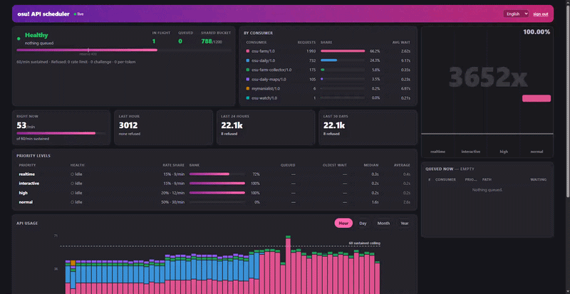

<div align="center">

# osu! API scheduler


**Manage your osu! API rate across projects.**

[](LICENSE)
[](https://nodejs.org)
[](docker-compose.yml)
[](#run-your-own)



</div>

---

Use this as you would use osu! API, except it manages the request scheduling based on the given priority, all to avoid any accidental API abuse.

The osu! rate limit is per IP. If you host several projects, even respecting the burst limits may get you rate-limited or IP banned.

> [!IMPORTANT]
> ### Run your own
>
> Every request you send carries your osu! token, and the scheduler reads the
> headers it forwards. Whoever runs an instance can read the tokens that pass
> through it.
>
> Point your projects at a scheduler you control. Do not use somebody else's,
> and do not offer yours. Do not trust an instance just because it is open sourced.

## Install with Docker

```bash
git clone https://github.com/Adrriii/osu-api-scheduler
cd osu-api-scheduler
cp .env.example .env
echo "SCHEDULER_TOKEN=$(openssl rand -base64 32 | tr -d '=+/')" >> .env
docker compose up -d
```

It listens on `127.0.0.1:7654`. Check it with `curl localhost:7654/healthz`.

## Install without Docker

Needs Node 22 or newer.

```bash
git clone https://github.com/Adrriii/osu-api-scheduler
cd osu-api-scheduler
sudo ./deploy/install.sh
```

That installs to `/opt/osu-api-scheduler`, creates a service user, generates a
token and starts `osu-api-scheduler.service`. It prints the token at the end.

## Send a request

Take any osu! API URL, swap the host for the scheduler, add two headers. Your
own osu! token still goes in `Authorization` as usual.

```bash
curl http://127.0.0.1:7654/api/v2/users/2/osu \
  -H "X-Scheduler-Token: YOUR_TOKEN" \
  -H "X-Osu-Priority: normal" \
  -H "Authorization: Bearer YOUR_OSU_TOKEN"
```

PHP:

```php
require_once '/opt/osu-api-scheduler/clients/php/OsuApiScheduler.php';

$r = OsuApiScheduler::request('api/v2/users/2/osu', OsuApiScheduler::P_NORMAL, [
    'consumer' => 'my-project/1.0',
    'headers'  => ['Authorization: Bearer ' . $osuToken],
]);

if ($r['scheduler_error'] !== null) {
    // Never reached osu!. Safe to retry later.
} else {
    $data = json_decode($r['body']);
}
```

TypeScript:

```ts
const PROJECT_NAME = 'my-project';
const PROEJCT_VERSION = '1.0';
const SCHEDULER = 'http://127.0.0.1:7654';
const TOKEN = process.env.SCHEDULER_TOKEN!;

type Priority = 'realtime' | 'interactive' | 'high' | 'normal';

class SchedulerError extends Error {}

async function osu<T>(path: string, priority: Priority, osuToken: string): Promise<T> {
  const res = await fetch(`${SCHEDULER}/${path}`, {
    headers: {
      'X-Scheduler-Token': TOKEN,
      'X-Osu-Priority': priority,
      'User-Agent': `${PROJECT_NAME}/${PROJECT_VERSION}`,
      Authorization: `Bearer ${osuToken}`,
    },
  });

  // Set only when the request never reached osu!, so it is safe to retry.
  // Anything else is osu! answering, including a 404.
  const failed = res.headers.get('x-scheduler-error');
  if (failed) throw new SchedulerError(failed);

  if (!res.ok) throw new Error(`osu! returned ${res.status}`);
  return res.json() as Promise<T>;
}

export function getUser(id: number, osuToken: string) {
  return osu<{ username: string }>(`api/v2/users/${id}/osu`, 'normal', osuToken);
}
```

## Priorities

Pick by what a delay costs you, not by how much you care about the job.

| `X-Osu-Priority` | Use it when |
|---|---|
| `realtime` | A missed window cannot be recovered later |
| `interactive` | Someone is waiting on the response |
| `high` | Background, but something visible is stale until it lands |
| `normal` | Routine background work, including sweeps |

Unset means `normal`.

## Dashboard

Open the scheduler in a browser. It shows what each priority is doing, what is
queued right now, latency per priority, and usage per project over the last
hour, day and month.

Pick one of three ways to protect it, in `.env`:

```ini
# A password
DASHBOARD_AUTH=password
DASHBOARD_PASSWORD=something-long

# Or osu! accounts you name
DASHBOARD_AUTH=oauth
DASHBOARD_ORIGIN=https://osu-api.example.com
DASHBOARD_OSU_CLIENT_ID=12345
DASHBOARD_OSU_CLIENT_SECRET=...
DASHBOARD_ALLOWED_OSU_IDS=2,1023489

# Or nothing, because your reverse proxy already asks
DASHBOARD_AUTH=none
```

For `oauth`, register an application at <https://osu.ppy.sh/home/account/edit>
with the callback URL set to `<DASHBOARD_ORIGIN>/auth/callback`.

## Put it on a domain

Point a hostname at the machine, then:

```bash
sudo ./deploy/setup-proxy.sh osu-api.example.com
```

That writes the vhost, enables it, reloads the web server and gets a
certificate. It picks Apache or nginx depending on what is installed, or pass
`--apache` / `--nginx`. Add `--no-tls` to skip certbot.

Same command whether the scheduler runs in Docker or on the host: both listen on
`127.0.0.1:7654`.

`/api/*` is safe to expose, it needs `SCHEDULER_TOKEN`. The templates in
`deploy/` have a commented-out block if you would rather keep it private anyway.

## Settings

Everything is optional except `SCHEDULER_TOKEN`. Defaults match what osu!
documents: 60 requests per minute, bursts to 1200.

| Variable | Default | |
|---|---|---|
| `SCHEDULER_TOKEN` | none | Required. Password your projects present |
| `SCHEDULER_PACE_SECONDS` | `1.0` | Seconds between requests. `1.0` is 60/min |
| `SCHEDULER_PORT` | `7654` | |
| `SCHEDULER_SHARE_*` | see `.env.example` | Each priority's slice of the rate |
| `SCHEDULER_BURST_*` | see `.env.example` | Each priority's spare capacity for a rush |
| `SCHEDULER_HOURLY_RETENTION_DAYS` | `90` | How long hour-by-hour detail is kept |
| `SCHEDULER_RETENTION_DAYS` | `3650` | How long daily usage totals are kept |

To change the rate while it runs, write the new value to
`$SCHEDULER_STATE_DIR/pace_interval`. It is read every second, no restart.

## Update

```bash
npm run update
```

Pulls the current branch, rebuilds only what changed, restarts, and waits for
the health check. If it does not come back healthy it rolls back to the commit
you were on. Docker and bare metal are detected, not configured; on bare metal
add `sudo` if the service runs from a directory you do not own.

```bash
npm run update -- --check    # say what would happen, change nothing
npm run update -- --force    # rebuild and restart even if nothing changed
```

Two schedulers must never run at once: each would keep its own token bucket and
spend the same per-IP budget twice, which is the lockout this whole thing exists
to avoid. So there is no overlapping handover. Three things cover the gap
instead:

- The build runs while the old process is still serving.
- `SIGTERM` finishes the queue it already accepted rather than failing it.
- systemd holds the listening socket, so callers connect normally while nothing
  is running and their requests wait in the kernel backlog.

Measured with the service fully stopped: the request still returned 200, in
0.17s, because the connection itself brought the service back up. Consumers see
latency, not errors.

On bare metal that socket is systemd's, installed and enabled by
`deploy/install.sh`. Under Docker the socket belongs to the container and an
update destroys it, so `docker-compose.yml` runs a second tiny service that owns
the published port and nothing else: it stays up across the swap, accepts the
connection, and holds the caller until the scheduler answers. Same trade as the
kernel backlog -- latency instead of failure. Measured against a scheduler
stopped outright: connecting directly failed instantly, through the front it
returned 200 after 6.4 seconds.

No off-the-shelf proxy does this, which is worth knowing before reaching for
one. Apache, nginx and HAProxy all answer 502 the moment a connect is refused,
and their retry settings only control how quickly they try again, not whether
they wait.

If you put a web server in front for TLS, `retry=0` on Apache's `ProxyPass` is
not optional. After one refused connection it marks the backend down and answers
502 for the next sixty seconds without trying again, so a two second restart
costs a minute. The template in `deploy/` sets it.

### Releasing

```bash
npm run bump             # asks which part to raise
npm run bump -- minor    # or say it outright
npm run bump -- 2.0.0    # or set it exactly
```

Writes the version to the root, `server` and `web` manifests and the lockfile.
The dashboard footer needs nothing further: the server reads the root
`package.json` at runtime, so the footer shows the new version once the service
restarts.

### Disk usage

Individual requests are never written to disk. The live feed, the last few
hours minute by minute, and the latency medians are all in memory. What is
stored is one row per hour per project per priority, and the same rolled to a
day.

At 60 requests a minute that is about **2 MB for 90 days** of hourly detail and
**4 MB for ten years** of daily totals. Storing each request instead would have
been 413 MB for 45 days.

A restart loses the feed and the minute-level shape. Everything the usage panel
shows survives it.

Latency is always measured over the last hour, whatever range is selected. A
median needs individual timings and those are the part kept in memory.

`.env.example` has the rest. [`DESIGN.md`](DESIGN.md) explains why the
scheduling works the way it does.

## Licence

[AGPL-3.0-or-later](LICENSE). If you run a modified copy as a network service, publish your
changes.
